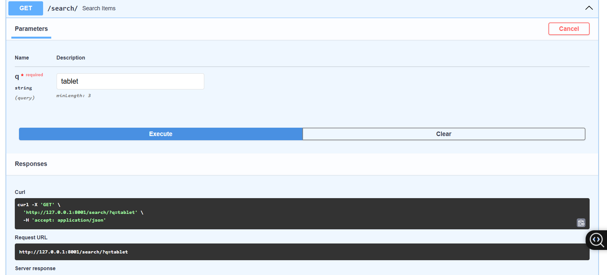
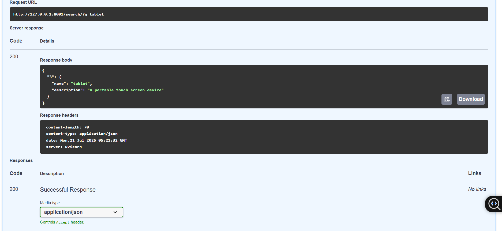

# FastAPI Project – Git & GitHub Integration

This repository demonstrates a simple web API using **FastAPI**, along with a complete **Git and GitHub** workflow using **GitHub Desktop**. It includes examples for GET (with path and query parameters), POST requests with Pydantic models, and file upload handling.

---

## Table of Contents

- [Version Control](#version-control)
- [Introduction to Git](#introduction-to-git)
- [Introduction to GitHub](#introduction-to-github)
- [GitHub Desktop Overview](#github-desktop-overview)
- [Setting Up GitHub Desktop](#setting-up-github-desktop)
- [Creating a Repository](#creating-a-repository)
- [Git Workflow with GitHub Desktop](#git-workflow-with-github-desktop)
- [Branching and Merging](#branching-and-merging)
- [Understanding Pull Requests](#understanding-pull-requests)
- [Stashing Changes](#stashing-changes)
- [Resolving Merge Conflicts](#resolving-merge-conflicts)
- [Using .gitignore](#using-gitignore)
- [Best Git Practices](#best-git-practices)
- [Setting Up and Running the Project](#setting-up-and-running-the-project)
- [API Demo with Screenshots](#api-demo-with-screenshots)

---

## Version Control

Version control enables developers to track changes, collaborate, and revert code when needed. It is essential for:

- Preventing loss of code
- Collaborating across teams
- Reproducing previous working versions

---

## Introduction to Git

Git is a **distributed version control system** that tracks project snapshots, not just file differences. 

**Key Concepts:**
- **Repository:** Project folder tracked by Git
- **Commit:** A saved state of the project
- **Branch:** An independent line of development
- **Merge:** Combining branches together

---

## Introduction to GitHub

GitHub is a cloud-based platform for Git repositories, providing:

- Online backups
- Team collaboration
- Pull request-based workflows

---

## GitHub Desktop Overview

**GitHub Desktop** provides a graphical interface to interact with Git and GitHub.

**Benefits:**
- Visualize changes
- Easily commit and push
- Manage branches and resolve conflicts

---

## Setting Up GitHub Desktop

1. Download: https://desktop.github.com/
2. Install and open the application.
3. Sign in using your GitHub account.

---

## Creating a Repository

### Option 1: New Local Repository
- Open GitHub Desktop → File → New Repository
- Set name, path, description → Create

### Option 2: Clone Remote Repository
- File → Clone Repository → Enter URL  
  Example:
  ```
  `https://github.com/FatimaRana50/FastAPI-API-with-Git-GitHub-Workflow`
  ```
---

## Git Workflow with GitHub Desktop

### Making Changes
Edit any file (e.g., `main.py`).

### Staging Changes
Review file diffs and select files to stage.

### Committing Changes
Write a descriptive commit message (e.g., `Add GET endpoint with path param`) and commit.

### Pushing Changes
Click `Push origin` to send your commits to GitHub.

### Pulling Changes
Use `Fetch origin` → `Pull` to update local repo with remote changes.

---

## Branching and Merging

### Why Branch?
Branching allows isolated work without affecting the `main` branch.

### Creating and Switching Branches
- Branch → New Branch (e.g., `feature/file-upload`)
- Use branch dropdown to switch between branches

### Merging
- Branch → Merge into current branch
- Resolve conflicts if needed, then commit the merge

---

## Understanding Pull Requests

**Pull Requests (PRs)** propose code changes from one branch to another.

### Steps:
1. Push branch to GitHub
2. Click "Compare & Pull Request"
3. Add description, reviewers
4. Review and Merge the PR

---

## Stashing Changes

Stash temporarily saves your uncommitted changes:
- GitHub Desktop → Branch → Stash Changes
- Later, apply the stash to continue work

---

## Resolving Merge Conflicts

Conflicts happen when changes clash. GitHub Desktop will:
- Show conflicting files
- Allow you to open and resolve conflicts
- Mark files as resolved and commit

---

## Using .gitignore

`.gitignore` avoids tracking unwanted files. Typical FastAPI ignores:
```
pycache/
*.py[cod]
venv/
.env
```


---

## Best Git Practices

- Make frequent, small commits with clear messages
- Use feature branches
- Keep pull requests focused
- Regularly pull from the remote repository
- Use issues to track tasks and bugs

---

## Setting Up and Running the Project

### Clone the Repository

```bash
git clone https://github.com/FatimaRana50/FastAPI-API-with-Git-GitHub-Workflow.git
cd FastAPI-API-with-Git-GitHub-Workflow
```
Create a Virtual Environment
```t
python -m venv venv
venv\Scripts\activate  # For Windows
# or
source venv/bin/activate  # For macOS/Linux
```
Install Dependencies
```
pip install -r requirements.txt
```
Run the FastAPI Server
```
uvicorn main:app --reload
```
Access the API
```
Swagger UI: http://127.0.0.1:8000/docs

ReDoc: http://127.0.0.1:8000/redoc
```

API Demo with Screenshots
GET with Query Parameter – Search
<table> <tr> <td><b>Input</b></td> <td><b>Output</b></td> </tr> <tr> <td></td> <td></td> </tr> </table>
POST Request with JSON Body
<table> <tr> <td><b>Input</b></td> <td><b>Output</b></td> </tr> <tr> <td></td> <td></td> </tr> </table>
File Upload
<table> <tr> <td><b>Upload File</b></td> <td><b>Upload Response</b></td> </tr> <tr> <td></td> <td></td> </tr> </table>
GET with Path Parameter
<table> <tr> <td><b>Input</b></td> <td><b>Output</b></td> </tr> <tr> <td></td> <td></td> </tr> </table>
About
This repository is a complete beginner-friendly guide to building and versioning a FastAPI project using Git, GitHub, and GitHub Desktop.
